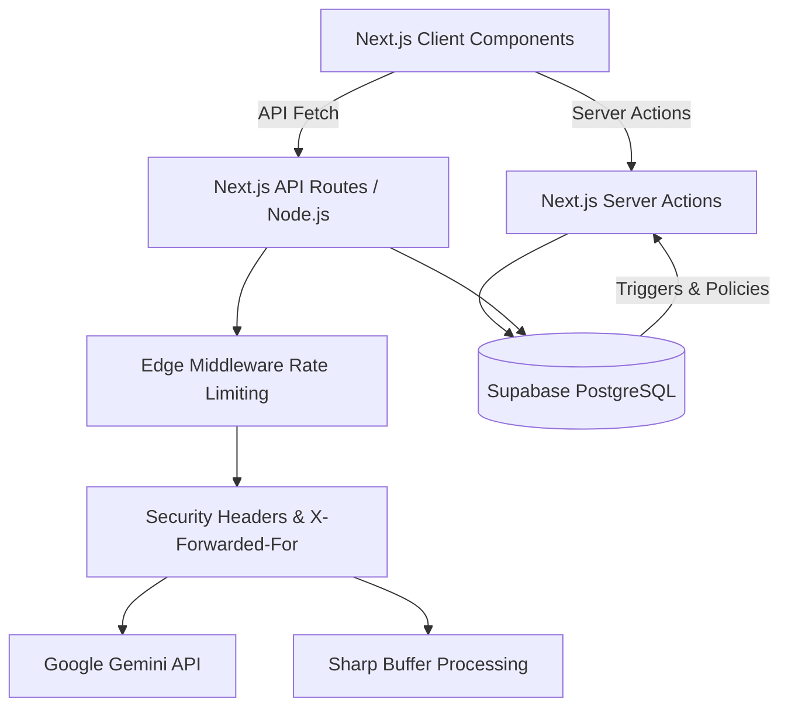

<div align="center">
  

  # 🏡 Thikana AI
  **The Next-Generation, AI-Powered Bilingual Rental & Matchmaking Marketplace for Bangladesh.**

  [](https://nextjs.org/)
  [](https://www.typescriptlang.org/)
  [](https://supabase.com/)
  [](https://deepmind.google/technologies/gemini/)
  [](https://tailwindcss.com/)

</div>

<br />

## 📖 Table of Contents
1. [Overview & Problem Statement](#-overview--problem-statement)
2. [Deep-Dive: Core AI Features](#-deep-dive-core-ai-features)
3. [Deep-Dive: Student & Tenant Features](#-deep-dive-student--tenant-features)
4. [System Architecture & Stack](#-system-architecture--stack)
5. [Database Schema](#-database-schema-supabase)
6. [Security & Edge Middleware](#-security--edge-middleware)
7. [Comprehensive Setup Guide](#-comprehensive-setup-guide)
8. [Folder Structure](#-folder-structure)

---

## 🌟 Overview & Problem Statement

**Thikana AI** is a state-of-the-art prop-tech platform engineered specifically for the chaotic rental market of Dhaka, Bangladesh. 

**The Problem:** The current rental ecosystem is plagued by fraudulent listings (stolen photos, bait-and-switch pricing), a lack of centralized market data causing arbitrary rent hikes, and massive friction for university students trying to find compatible flatmates and manage shared expenses.

**The Solution:** Thikana acts as a secure, intelligent intermediary. By enforcing strict, AI-driven cryptographic validation of property photos, analyzing market sentiment via Google Gemini, and providing robust matchmaking logic, Thikana ensures that landlords get verified tenants and tenants find secure, fairly-priced housing. 

---

## ✨ Deep-Dive: Core AI Features

Thikana leverages the power of **Google Gemini 1.5 Flash** and **Gemini 1.5 Pro** across multiple distinct micro-features to ensure data integrity and user empowerment.

### 1. 🛡️ AI Trust Score & Perceptual Hashing (pHash)
Fraud prevention is the cornerstone of Thikana. When a landlord publishes a listing, an asynchronous Trust Score calculation is triggered:
*   **Cryptographic Image Verification (`sharp`)**: We don't just check if image URLs match. We buffer the incoming images, downsample them to an 8x8 grayscale thumbnail, calculate the mean pixel intensity, and generate a **64-bit binary average hash (aHash)**. 
*   **Hamming Distance Algorithm**: We compare the incoming 64-bit hash against the `photo_hashes` column of every other listing in our Supabase PostgreSQL database. A Hamming distance of $\le 10$ bits (approx 15% variance) instantly flags the image as stolen or reused, tanking the landlord's Trust Score.
*   **NLP Duplicate Detection**: The listing's English and Bengali descriptions are vectorized using term-frequency analysis. We compute the Cosine Similarity against existing listings. A similarity $> 70\%$ triggers a duplicate warning.

> 📸 **[Placeholder: Insert screenshot of the Trust Score Badge UI here]**

### 2. 📸 Real-Time AI Photo Scoring (Gemini Vision)
We provide real-time coaching to landlords. During the listing creation flow, as a landlord selects photos:
*   The images are converted to Base64 via `FileReader`.
*   A request is sent to our `api/ai/photo-score` endpoint, which utilizes **Gemini 1.5 Flash Vision**.
*   The AI evaluates the photo for **Brightness, Clarity, Subject Framing, and Staging (Cleanliness)**.
*   **Dynamic UI Feedback**: The UI overlays a live badge (🟩 Green $\ge 70$, 🟧 Amber $40-69$, 🟥 Red $< 40$) on the image thumbnail, along with a dismissible, actionable tip (e.g., *"Try taking this photo near a window to increase brightness"*). If any photo scores under 40, a global warning banner prevents the landlord from accidentally publishing low-quality media.

> 📸 **[Placeholder: Insert screenshot of the Photo Scoring UI with Green/Amber/Red badges here]**

### 3. 🧠 Smart Rent Estimator
To combat arbitrary rent pricing, Thikana features a robust Rent Estimator:
*   **Deterministic Fallback**: Uses a hardcoded mapping of Dhaka's neighborhood medians (e.g., Mirpur-10, Gulshan, Dhanmondi). It mathematically applies modifiers based on floor level, furnishing status, and room count.
*   **AI Reasoning Pipeline**: When the Gemini API is available, it injects the baseline calculation into a prompt context, asking Gemini to analyze real-time market sentiment and provide a grounded, intelligent JSON response containing the `min`, `max`, and `median` fair market value.

---

## 🤝 Deep-Dive: Student & Tenant Features

### 1. 🔔 Smart Match Alerts (Cron-Ready)
Tenants don't need to refresh the feed manually. 
*   Users configure highly granular search filters (Area, Max Rent, Bed count, Furnishing).
*   The filters are saved to the `saved_searches` table in Supabase.
*   A persistent Notification Bell UI allows users to manage and delete their active alerts.

### 2. 👥 Flatmate Matchmaking
Designed for the thousands of university students migrating to Dhaka:
*   **Profile Matching**: Students create profiles indicating their University (BRACU, NSU, IUT, etc.), budget, gender preference, and vital lifestyle habits (Night owl vs. Early riser, Smoker vs. Non-smoker).
*   The UI actively highlights "High Compatibility" matches based on intersecting lifestyle arrays.

### 3. 💸 Utility & Bill Splitter
A dedicated Finance dashboard for students sharing flats:
*   Tracks monthly allowances and anticipated rent.
*   Includes a **Utility Bill Splitter**: Input the total monthly utility bill (Gas + Water + Electricity) and the number of flatmates. The system calculates exact individual shares and dynamically updates the student's personal budget forecast with CountUp animations.

> 📸 **[Placeholder: Insert screenshot of the Flatmate Matchmaking or Bill Splitter UI here]**

---

## 🏗️ System Architecture & Stack

Thikana relies on a hyper-modern edge computing stack to deliver fast, secure, and AI-driven experiences.



### Core Technologies
*   **Framework**: Next.js 15 (App Router, Turbopack, React Server Components)
*   **Language**: TypeScript (Strict mode enabled)
*   **Database & Auth**: Supabase (PostgreSQL, Row Level Security)
*   **AI Integration**: `@google/generative-ai` (Gemini 1.5 Flash & Pro)
*   **Styling & UI**: Tailwind CSS, Lucide React (Icons), Framer Motion (Animations)
*   **Image Processing**: `sharp` (for server-side aHash generation)

---

## 🗄️ Database Schema (Supabase)

The PostgreSQL backend is structured for performance and relation integrity.

### 1. `listings` Table
The core property table.
- `id` (uuid, primary key)
- `landlord_id` (uuid, foreign key to auth.users)
- `title_en` / `title_bn` (text) - Bilingual titles
- `description_en` / `description_bn` (text)
- `area`, `address` (text)
- `rent_bdt`, `rooms`, `bathrooms`, `floor` (numeric)
- `photos` (text[]) - Array of image URLs
- `photo_hashes` (text[]) - **Computed 64-bit aHash values for pHash verification**
- `trust_score` (numeric) - AI-calculated integrity metric

### 2. `trust_scores` Table
Stores the historical breakdown of *why* a listing received its score.
- `listing_id` (uuid)
- `total_score` (numeric)
- `ai_description_score`, `duplicate_penalty`, `phash_image_score` (numeric) - Granular scoring breakdown.

### 3. `saved_searches` Table
Powers the Smart Match Alerts system.
- `user_id` (uuid)
- `area`, `type`, `furnishing` (text)
- `max_rent`, `rooms` (numeric)

---

## 🔒 Security & Edge Middleware

Thikana treats user data and application stability with strict rigor:
*   **Global Rate Limiting (`src/middleware.ts`)**: Custom in-memory rate limiter tracking the `x-forwarded-for` header to block abusive IP addresses. Limits traffic to a maximum of 100 requests per minute per IP, returning a `429 Too Many Requests` status code.
*   **Strict Security Headers (`next.config.ts`)**: Native Next.js headers block common web vulnerabilities:
    - `Strict-Transport-Security`: Enforces HTTPS globally.
    - `X-XSS-Protection`: Prevents cross-site scripting attacks.
    - `X-Frame-Options: SAMEORIGIN`: Prevents Clickjacking.
    - `X-Content-Type-Options: nosniff`: Prevents MIME-type sniffing.
    - `Permissions-Policy`: Restricts unauthorized access to camera, microphone, and geolocation.

---

## 🚀 Comprehensive Setup Guide

### 1. Prerequisites
Ensure you have the following installed on your machine:
- **Node.js** (v18 or higher)
- **npm** or **pnpm**
- A **Supabase** account and project.
- A **Google Gemini API Key** (from Google AI Studio).

### 2. Environment Variables
Clone the repository and create a `.env` file in the root directory:
```env
NEXT_PUBLIC_SUPABASE_URL=your_supabase_project_url
NEXT_PUBLIC_SUPABASE_ANON_KEY=your_supabase_anon_key
GOOGLE_GEMINI_API_KEY=your_gemini_api_key
```

### 3. Database Setup (Supabase SQL Editor)
Navigate to your Supabase dashboard, open the SQL Editor, and execute the migration files found in `supabase/migrations/` sequentially:
1.  **`001_initial_schema.sql`**: Sets up the core `listings` and `users` tables, enabling Row Level Security (RLS).
2.  **`002_dummy_data.sql`**: Seeds the database with realistic mock properties across Dhaka.
3.  **`003_trust_score_migration.sql`**: Configures the `trust_scores` architecture.
4.  **`004_photo_hashes.sql`**: Appends the critical `photo_hashes text[]` array to the `listings` table for pHash cryptographic verification.

### 4. Installation & Execution
```bash
# Install all dependencies (including Sharp for Node.js image processing)
npm install

# Run the development server using Next.js Turbopack
npm run dev
```

Navigate to `http://localhost:3000` to experience Thikana AI.

---

## 📁 Folder Structure

A high-level overview of the codebase organization:

```text
ThikanaAi/
├── src/
│   ├── app/
│   │   ├── actions/          # Server Actions (e.g., ai-trust-score calculation)
│   │   ├── api/
│   │   │   ├── ai/           # Gemini Integration endpoints (rent-estimate, photo-score)
│   │   │   ├── alerts/       # Saved search API routes
│   │   │   └── utils/        # Utility endpoints (hash-photos)
│   │   ├── auth/             # Login/Signup flows
│   │   ├── listings/         # Property marketplace, creation flow, and rent estimators
│   │   ├── student/          # Financial tracking, bill splitters, and flatmate matchmaking
│   │   ├── alerts/           # Tenant Smart Match Alert dashboard
│   │   └── page.tsx          # Main Landing Page
│   ├── components/           # Reusable UI components (Cards, Buttons, Map, Navbar)
│   ├── lib/                  # Utilities (Gemini client, Sharp image-hash engine, Supabase)
│   └── middleware.ts         # Edge Rate Limiting & Auth Session Management
├── supabase/
│   └── migrations/           # PostgreSQL Schema Definitions
├── next.config.ts            # Security Headers & Remote Patterns
└── package.json              # Project dependencies
```

---

<div align="center">
  <i>Built with ❤️ for Bangladesh. Revolutionizing the way we find our next home.</i>
</div>
